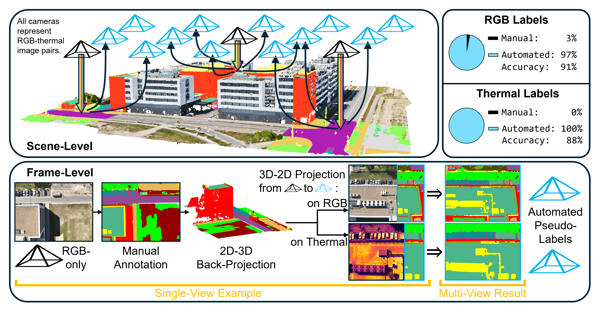
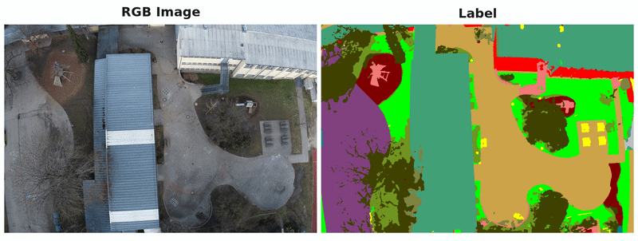
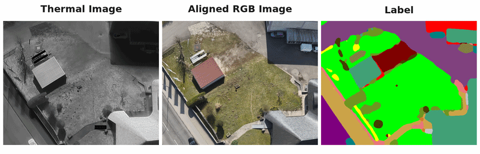
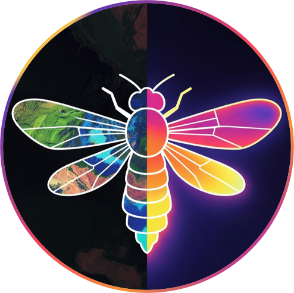
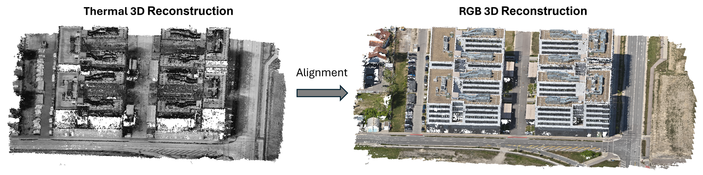

<div align="center">


# A Dataset and 2D-3D-2D Paradigm for Aerial RGB-Thermal Semantic Segmentation at Scale

### 🌟 ECCV 2026 🌟

[](https://markus-42.github.io/publications/2026/segfly/)&nbsp;&nbsp;
[](https://arxiv.org/abs/2603.17920)&nbsp;&nbsp;
[](https://huggingface.co/datasets/markus-42/SegFly)&nbsp;&nbsp;
[](https://huggingface.co/markus-42/SegFly-Firefly)

[Markus Gross](https://markus-42.github.io/)<sup>1,2,3,<a href="mailto:markus.gross@tum.de?subject=IPFormer" style="color: #4799e0; text-decoration: underline;">📧</a></sup>,&nbsp;
[Sai B. Matha](https://bharadhwajsaimatha.github.io/portfolio/)<sup>1</sup>,&nbsp;
[Rui Song](https://rruisong.github.io/)<sup>4,5</sup>,&nbsp;
[Viswanathan Muthuveerappan](https://www.linkedin.com/in/viswanathan-muthuveerappan-839246193/)<sup>1</sup>,&nbsp;
[Conrad Christoph](https://www.linkedin.com/in/conrad-christoph-216255341/)<sup>1</sup>,&nbsp;
[Julius Huber](https://www.linkedin.com/in/julius-huber-ai/)<sup>1</sup>,&nbsp;
[Daniel Cremers](https://scholar.google.com/citations?user=cXQciMEAAAAJ&hl=en) <sup>2,3</sup>


<sup>1</sup> [Fraunhofer IVI](https://www.ivi.fraunhofer.de/en/research-fields/advanced-air-mobility/autonomous-flying.html)&nbsp;&nbsp;&nbsp;&nbsp;
<sup>2</sup>
[TU Munich](https://cvg.cit.tum.de/)&nbsp;&nbsp;&nbsp;&nbsp;
<sup>3</sup>
[MCML](https://mcml.ai/research/groups/cremers/)&nbsp;&nbsp;&nbsp;&nbsp;
<sup>4</sup>
[UCLA](https://mobility-lab.seas.ucla.edu/)&nbsp;&nbsp;&nbsp;&nbsp;
<sup>5</sup>
[Uni Cambridge](https://cv4dt.github.io/)&nbsp;&nbsp;&nbsp;&nbsp;




</div>

# 🚀 News
- **[2026/07]:** [Firefly segmentation model](https://huggingface.co/models/markus-42/SegFly-Firefly)  released on HuggingFace 🤗
- **[2026/07]:** [SegFly RGB-Thermal dataset](https://huggingface.co/datasets/markus-42/SegFly)  released on HuggingFace 🤗
- **[2026/06]:** SegFly accepted to ECCV 2026 🥳
- **[2026/03]:** [Project page](https://markus-42.github.io/publications/2026/segfly/) online
- **[2026/03]:** [Preprint](https://arxiv.org/abs/2603.17920) available on arXiv

# Table of Contents
1. [Abstract](#1-abstract)
2. [Download SegFly Dataset](#2-download-segfly-dataset)
3. [SegFly Dataset Documentation](#3-segfly-dataset-documentation)
4. [Firefly Model: RGB and Thermal Semantic Segmentation](#4-firefly-model-rgb-and-thermal-semantic-segmentation)
5. [RGB-Thermal Image Registration](#5-rgb-thermal-image-registration)
6. [Citation](#6-citation)
7. [License](#7-license)


# 1. Abstract
Semantic segmentation for uncrewed aerial vehicles (UAVs) is fundamental for aerial scene understanding, yet existing RGB and RGB-T datasets remain limited in scale, diversity, and annotation efficiency due to the high cost of manual labeling and the difficulties of accurate RGB-T alignment on off-the-shelf UAVs. To address these challenges, we propose a scalable geometry-driven 2D-3D-2D paradigm that leverages multi-view redundancy in high-overlap aerial imagery to automatically propagate labels from a small subset of manually annotated RGB images to both RGB and thermal modalities within a unified framework. By lifting less than 3% of RGB images into a semantic 3D point cloud and rendering it into all views, our approach enables dense pseudo ground-truth generation across large image collections, automatically producing 97% of RGB labels and 100% of thermal labels while achieving 91% and 88% annotation accuracy without any 2D manual refinement. We further extend this 2D-3D-2D paradigm to cross-modal image registration, using 3D geometry as an intermediate alignment space to obtain fully automatic, strong pixel-level RGB-T alignment with 87% registration accuracy and no hardware-level synchronization. Applying our framework to existing geo-referenced aerial imagery, we construct SegFly, a large-scale benchmark with over 20,000 high-resolution RGB images and more than 15,000 geometrically aligned RGB-T pairs spanning diverse urban, industrial, and rural environments across multiple altitudes and seasons. On SegFly, we establish the Firefly baseline for RGB and thermal semantic segmentation and show that both conventional architectures and vision foundation models benefit substantially from SegFly supervision, highlighting the potential of geometry-driven 2D-3D-2D pipelines for scalable multi-modal aerial scene understanding.

# 2. Download SegFly Dataset


The dataset is available on HuggingFace: [SegFly Dataset](https://huggingface.co/datasets/markus-42/SegFly). Note that when you download the dataset, there is only a single split/container having all scenes combined. See [3. SegFly Dataset Documentation](#3-segfly-dataset-documentation) for more details on the actual train/val/test splits.

You can use the HuggingFace `datasets` library to download the dataset as follows:

1. Install dependencies:

    ```bash
    pip install datasets huggingface_hub
    ```

2. Download the dataset:

    ```python
    from datasets import load_dataset

    segfly_ds = load_dataset("markus-42/SegFly")
    ```

### Hugging Face Dataset Object Structure
When loaded in Python via `load_dataset()`, the returned object is a HuggingFace `DatasetDict` containing splits. Each sample contains the following features:

| Feature | Type | Description |
| :--- | :---: | :--- |
| `image` | `Image` | Raw sensor image (RGB for visual modality, LWIR for thermal modality) |
| `label` | `Image` | Semantic segmentation ground-truth mask (8-bit single-channel image) |
| `RGB_aligned` | `Image` | Geometrically-registered RGB image (thermal modality only; returns `None` for RGB modality) |
| `scene` | `string` | Scene ID (e.g., `"scene_01"` to `"scene_09"`) |
| `altitude` | `string` | Flight altitude (e.g., `"30m"`, `"40m"`, `"50m"`) |
| `modality` | `string` | Imaging modality (`"RGB"` or `"thermal"`) |


# 3. SegFly Dataset Documentation


## Splits

#### RGB Modality:

| Split | Scenes |
| :--- | :--- |
| Train | 01, 02, 03, 04, 05 |
| Val | 06, 07 |
| Test | 08, 09 |



#### Thermal Modality:

| Split | Scenes |
| :--- | :--- |
| Train | 03, 04, 05 |
| Val/Test | 09 |



## Directory Structure

When downloading the dataset repository directly (e.g., via `git clone` or `huggingface-cli download`), the folder structure is organized hierarchically by modality, scene identifier, and flight altitude:

<details>
<summary><b>Click to expand dataset directory tree</b></summary>

```
SegFly/
├── RGB/                            # RGB-only modality data (Scenes 1-9)
│   ├── scene_01/                   # Individual scene folder
│   │   ├── 30m/                    # Flight altitude folder (30 meters)
│   │   │   ├── images/             # Source RGB images (.JPG format, high resolution)
│   │   │   ├── labels/             # 8-bit semantic label masks (.png format)
│   │   │   └── metadata.csv        # Frame-specific metadata mapping (relative paths, labels, scene, altitude)
│   │   ├── 40m/                    # Flight altitude folder (40 meters)
│   │   └── 50m/                    # Flight altitude folder (50 meters)
│   ├── scene_02/
│   ...
│   └── scene_09/
└── thermal/                        # RGB-Thermal paired modality data (Scenes 3, 4, 5, 9)
    ├── scene_03/                   # Individual scene folder
    │   ├── 30m/                    # Flight altitude folder (30 meters)
    │   │   ├── images/             # Source thermal images (LWIR, .JPG format, 640x512)
    │   │   ├── RGB_aligned/        # Source RGB images geometrically registered to thermal perspective (.jpg format)
    │   │   ├── labels/             # 8-bit semantic label masks matching the thermal viewpoint (.png format)
    │   │   └── metadata.csv        # Frame-specific metadata mapping (includes paths for aligned RGB)
    │   ├── 40m/                    # Flight altitude folder (40 meters)
    │   └── 50m/                    # Flight altitude folder (50 meters)
    ├── scene_04/
    ├── scene_05/
    └── scene_09/
```

</details>

### Folder & File Descriptions:
- **`images/`**: Contains raw, original sensor images (high-resolution RGB for the RGB modality, and 640x512 Long-Wave Infrared for the thermal modality).
- **`RGB_aligned/`**: *(Thermal Modality Only)* Contains RGB images that have been projected and registered to match the thermal camera's viewpoint, resolution, intrinsics, and lense distortion.
- **`labels/`**: Contains 8-bit, single-channel PNG images where each pixel's value corresponds directly to a semantic class ID (0–36).
- **`metadata.csv`**: Contains a Hugging Face `ImageFolder`-compatible manifest file mapping `file_name` (sensor image), `label` (segmentation mask), and `RGB_aligned` paths along with categorical columns for `scene`, `altitude`, and `modality`.


## Semantic Classes

To handle rare or dynamic categories that cannot be reconstructed reliably via static 3D SfM (e.g., pedestrians, moving vehicles, cables), SegFly applies a post-processing step to map the original 22 annotations of the underlying [OccuFly dataset](https://markus-42.github.io/publications/2026/occufly/) into **15 benchmark classes** plus an ignored `Unlabeled` category (ID `0`).

- **Merged Classes**: `Rock` (ID 5) and `Cable Tower` (ID 22) are merged into `Ground Obstacle` (ID 9).
- **Ignored/Unlabeled**: `Person` (11), `Bicycle` (12), `Cable` (21), `Crane` (35), and boundary pixels are mapped to `Unlabeled` (ID 0).

<details>
<summary><b>Click to view complete Class Mapping Reference Table</b></summary>
<br>
Note that class IDs are not contiguous and include gaps in the range 0–36

| Class ID | Class Name | RGB Color | Color Preview | Notes / Post-Processing |
| :---: | :--- | :---: | :---: | :--- |
| **0** | Unlabeled / Ignored | `[0, 0, 0]` | <span style="display:inline-block; width:12px; height:12px; background-color:#000000; border:1px solid #000; margin-right:5px;"></span>`#000000` | Dynamic/ambiguous classes (Person, Bicycle, Cable, Crane) |
| **1** | Road | `[128, 0, 128]` | <span style="display:inline-block; width:12px; height:12px; background-color:#800080; border:1px solid #000; margin-right:5px;"></span>`#800080` | |
| **2** | Walkway | `[204, 163, 72]` | <span style="display:inline-block; width:12px; height:12px; background-color:#cca348; border:1px solid #000; margin-right:5px;"></span>`#cca348` | |
| **3** | Dirt | `[128, 0, 0]` | <span style="display:inline-block; width:12px; height:12px; background-color:#800000; border:1px solid #000; margin-right:5px;"></span>`#800000` | |
| **4** | Gravel | `[192, 192, 192]` | <span style="display:inline-block; width:12px; height:12px; background-color:#c0c0c0; border:1px solid #000; margin-right:5px;"></span>`#c0c0c0` | |
| **6** | Grass | `[0, 255, 0]` | <span style="display:inline-block; width:12px; height:12px; background-color:#00ff00; border:1px solid #000; margin-right:5px;"></span>`#00ff00` | |
| **7** | Vegetation | `[112, 148, 32]` | <span style="display:inline-block; width:12px; height:12px; background-color:#709420; border:1px solid #000; margin-right:5px;"></span>`#709420` | |
| **8** | Tree | `[64, 64, 0]` | <span style="display:inline-block; width:12px; height:12px; background-color:#404000; border:1px solid #000; margin-right:5px;"></span>`#404000` | |
| **9** | Ground Obstacle | `[255, 255, 0]` | <span style="display:inline-block; width:12px; height:12px; background-color:#ffff00; border:1px solid #000; margin-right:5px;"></span>`#ffff00` | Includes merged `Rock` and `Cable Tower` classes |
| **13** | Vehicle | `[0, 128, 128]` | <span style="display:inline-block; width:12px; height:12px; background-color:#008080; border:1px solid #000; margin-right:5px;"></span>`#008080` | |
| **14** | Water | `[0, 0, 255]` | <span style="display:inline-block; width:12px; height:12px; background-color:#0000ff; border:1px solid #000; margin-right:5px;"></span>`#0000ff` | |
| **16** | Building | `[255, 0, 0]` | <span style="display:inline-block; width:12px; height:12px; background-color:#ff0000; border:1px solid #000; margin-right:5px;"></span>`#ff0000` | |
| **17** | Roof | `[64, 160, 120]` | <span style="display:inline-block; width:12px; height:12px; background-color:#40a078; border:1px solid #000; margin-right:5px;"></span>`#40a078` | |
| **33** | Parking Lot | `[128, 64, 128]` | <span style="display:inline-block; width:12px; height:12px; background-color:#804080; border:1px solid #000; margin-right:5px;"></span>`#804080` | |
| **34** | Construction | `[240, 120, 120]` | <span style="display:inline-block; width:12px; height:12px; background-color:#f07878; border:1px solid #000; margin-right:5px;"></span>`#f07878` | |
| **36** | Truck | `[128, 128, 64]` | <span style="display:inline-block; width:12px; height:12px; background-color:#808040; border:1px solid #000; margin-right:5px;"></span>`#808040` | |

</details>


# 4. Firefly Model: RGB and Thermal Semantic Segmentation

<div align="center">



</div>

We provide our aerial RGB and thermal semantic segmentation model [Firefly on HuggingFace](https://huggingface.co/markus-42/SegFly-Firefly). Check the model card for detailed documentation.

# 5. RGB-Thermal Image Registration

<div align="center">



</div>


A major challenge in multimodal drone perception is the alignment of RGB and thermal cameras without specialized hardware synchronization or static sensor configurations. Since these capabilities are generally available only on custom sensor rigs, existing approaches often cannot be deployed on off-the-shelf drones. SegFly resolves this entirely in software through geometry-guided registration:
1. **Independent 3D Reconstructions**: SFM and MVS are run independently on both the RGB and thermal sequences.
2. **ICP Point Cloud Alignment**: The thermal 3D point cloud is aligned to the metric RGB point cloud using the **Iterative Closest Point (ICP)** algorithm, yielding a rigid transform.
3. **Lens-Distortion Transfer**: The aligned camera poses and calibrated distortion models are used to warp the RGB images directly into the thermal camera's viewpoint, producing the registered pixel-level aligned RGB images.

This achieves a strong cross-modal semantic registration accuracy of **87.05%** entirely in software, without specialized hardware sync or static sensor configurations, enabling easy multi-modal dataset scaling using off-the-shelf drone hardware.

For detailed explanations, please refer to the our SegFly paper.


# 6. Citation

If this repository or our work was helpful to you, we would appreciate citing our papers and giving the repository a star ⭐

```bibtex
@inproceedings{gross2026segfly,
    title={{SegFly: A Dataset and 2D-3D-2D Paradigm for Aerial RGB-Thermal Semantic Segmentation at Scale}}, 
    author={Markus Gross and Sai Bharadhwaj Matha and Rui Song and Viswanathan Muthuveerappan and Conrad Christoph and Julius Huber and Daniel Cremers},
    booktitle = {Proceedings of the European Conference on Computer Vision (ECCV)},
    year={2026},
}
```


Since SegFly is based on the [OccuFly dataset](https://markus-42.github.io/publications/2026/occufly/), consider citing this work as well:

```bibtex
@inproceedings{gross2026occufly,
    title={{OccuFly: A 3D Vision Benchmark for Semantic Scene Completion from the Aerial Perspective}}, 
    author={Markus Gross and Sai B. Matha and Aya Fahmy and Rui Song and Daniel Cremers and Henri Meess},
    booktitle = {Proceedings of the IEEE/CVF Conference on Computer Vision and Pattern Recognition (CVPR)},
    year={2026},
}
```

# 7. License

This work is licensed under the [CC BY-NC-SA 4.0 license](https://creativecommons.org/licenses/by-nc-sa/4.0/). See the LICENSE file for the full legal terms.
